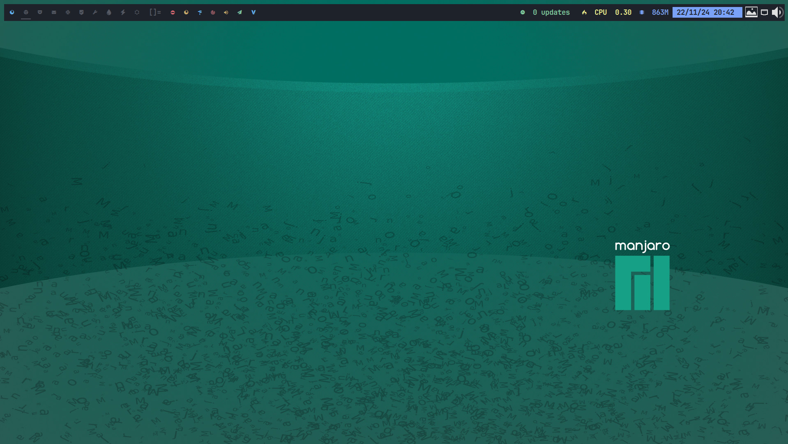
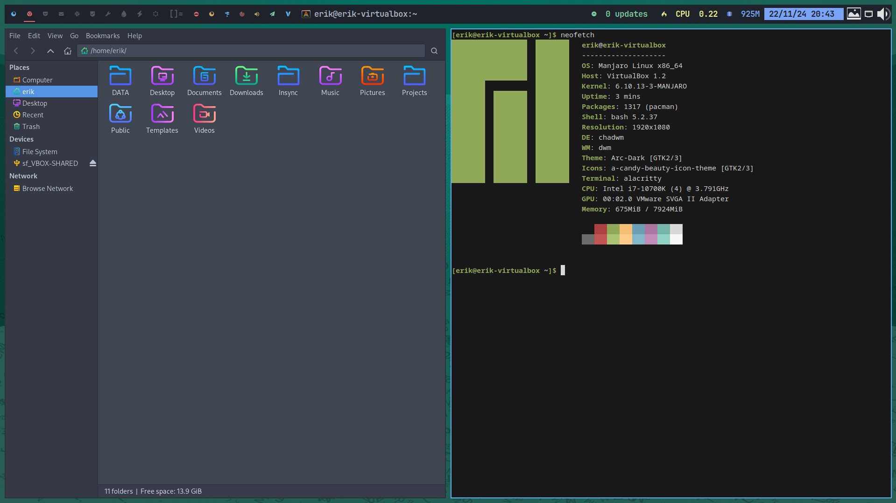
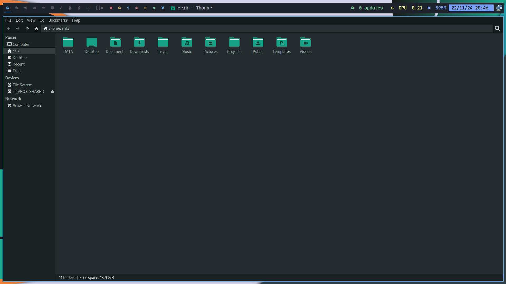

<h1 align="center">
 
   
   Manjaro Chadwm
</h1>

# Chadwm is a fork from Dwm

At ArcoLinux, we have developed our own version of this TWM, tailored to meet our specific needs. We install and refine it on any Linux system until it meets our standards of perfection.

# CODE

The code can be found as part of ArcoLinux Nemesis.

https://github.com/erikdubois/arcolinux-nemesis

Open a terminal in the folder and run the starting script.

./0 and press twice on TAB and it will run the scripts. 

Or choose the scripts you want to run.

# Youtube

Watch the videos 

https://www.youtube.com/playlist?list=PLlloYVGq5pS4dMHsRIx6RAfbLNNMOEdCM

# Examples

